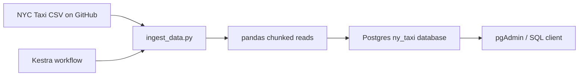

# Docker Workshop

Hands-on workshop material for learning Docker, containerized data pipelines, and workflow orchestration.

The repo is centered around a small NYC taxi ingestion pipeline that downloads public taxi data, loads it into Postgres, and can be run either locally with Python or inside containers. It also includes a starter Kestra workflow section for orchestration exercises.

## What is in this repo

- `pipeline/` - the main data pipeline example.
  - `ingest_data.py` downloads NYC taxi CSV data and writes it into Postgres in chunks.
  - `Dockerfile` builds a container for the ingestion script.
  - `docker-compose.yaml` boots Postgres, pgAdmin, and Kestra for the workshop.
  - `main.py` and `pipeline.py` are simple Python entry points / practice files.
  - `notebook.ipynb` and `zones.ipynb` are exploration notebooks.
- `02-workflow-orchestration/flows/` - Kestra flow examples.
  - `01_hello_world.yaml` demonstrates inputs, variables, logs, a return value, sleep, and a scheduled trigger.
- `README.md` - this guide.

## Architecture

The main ingestion workflow looks like this:

1. Download a monthly NYC yellow taxi dataset from the DataTalksClub release on GitHub.
2. Read the compressed CSV in chunks with pandas.
3. Create the destination table in Postgres from the first chunk.
4. Append the remaining chunks into the same table.
5. Inspect the loaded data with pgAdmin or SQL clients.

The orchestration example adds Kestra on top so you can move from a single containerized job to a scheduled workflow.



## Prerequisites

- Docker and Docker Compose
- Python 3.13 if you want to run the script locally
- `uv` for local dependency management in `pipeline/`

## Quick Start

### 1. Start the workshop stack

From `pipeline/`:

```bash
docker compose up -d
```

This starts:

- Postgres on `localhost:5432`
- pgAdmin on `localhost:8085`
- Kestra on `localhost:8080`

### 2. Load taxi data into Postgres

Run the ingestion script locally with `uv`:

```bash
cd pipeline
uv sync
uv run python ingest_data.py \
  --pg-user=root \
  --pg-pass=root \
  --pg-host=localhost \
  --pg-port=5432 \
  --pg-db=ny_taxi \
  --year=2021 \
  --month=1 \
  --target-table=yellow_taxi_data \
  --chunksize=100000
```

Or build and run the containerized version:

```bash
cd pipeline
docker build -t taxi_ingest:v001 .
docker run --rm \
  --network=pipeline_default \
  taxi_ingest:v001 \
  --pg-user=root \
  --pg-pass=root \
  --pg-host=pgdatabase \
  --pg-port=5432 \
  --pg-db=ny_taxi \
  --target-table=yellow_taxi_data \
  --chunksize=100000
```

## Docker Compose Services

The compose file wires together the workshop services:

- `pgdatabase`: Postgres 18 with the `ny_taxi` database
- `pgadmin`: browser-based Postgres administration
- `kestra_postgres`: metadata database for Kestra
- `kestra`: Kestra server in standalone mode

The `pgdatabase` service is configured with the following defaults:

- user: `root`
- password: `root`
- database: `ny_taxi`

The pgAdmin login defaults are:

- email: `admin@admin.com`
- password: `root`

Kestra is exposed on `localhost:8080` and uses basic auth with:

- username: `admin@kestra.io`
- password: `Admin1234!`

## Running the Ingestion Script Directly

`pipeline/ingest_data.py` is a Click-based CLI. The most relevant options are:

- `--pg-user`, `--pg-pass`, `--pg-host`, `--pg-port`, `--pg-db`
- `--year`, `--month`
- `--target-table`
- `--chunksize`

Example:

```bash
python ingest_data.py --month=3 --target-table=yellow_taxi_march_2021
```

The script uses chunked reads to avoid loading the full dataset into memory, which makes it a good workshop example for practical ETL design.

## Kestra Flow Example

`02-workflow-orchestration/flows/01_hello_world.yaml` demonstrates a small but complete workflow:

- an input parameter with a default value
- a template variable
- logging tasks
- a return/debug task
- a sleep task
- a scheduled trigger that is disabled by default

Use it as the starting point for exploring orchestration concepts such as triggers, inputs, task outputs, and retries.

## Repository Structure

```text
.
├── README.md
├── 02-workflow-orchestration/
│   └── flows/
│       ├── 01_hello_world.yaml
│       └── 02_python.yaml
└── pipeline/
    ├── Dockerfile
    ├── docker-compose.yaml
    ├── ingest_data.py
    ├── main.py
    ├── pipeline.py
    ├── pyproject.toml
    ├── notebook.ipynb
    └── zones.ipynb
```

## Notes

- `pipeline/main.py` is a simple starter entry point.
- `pipeline/pipeline.py` is currently a lightweight demo script that writes a small parquet file.
- `02-workflow-orchestration/flows/02_python.yaml` is empty and can be used as a follow-up exercise.

## Troubleshooting

- If Postgres is not reachable, confirm the `pipeline_default` network exists by starting the compose stack from `pipeline/`.
- If the ingestion script fails on package imports, run `uv sync` inside `pipeline/` first.
- If pgAdmin cannot connect, make sure Postgres is already healthy before opening the UI.

## Next Steps

- Add a Kestra flow that triggers the ingestion container on a schedule.
- Add tests around the ingestion logic and CLI options.
- Extend the pipeline to land data in a warehouse-friendly format or add data quality checks.
